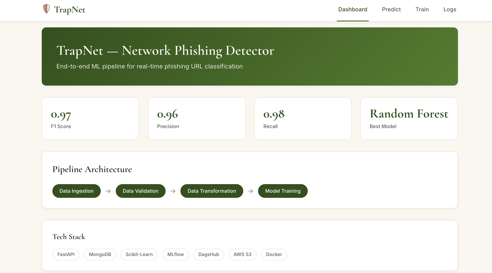
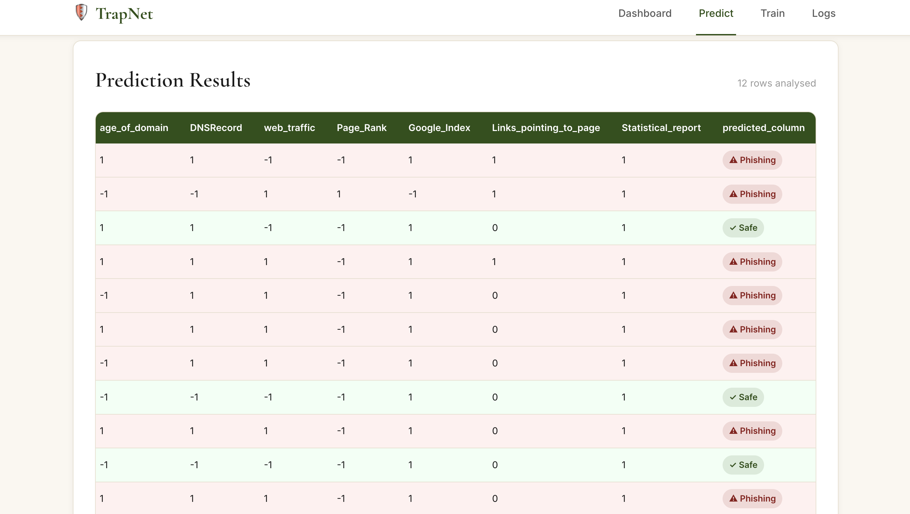

# TrapNet — Network Phishing Detector


---

## 1. Project Overview

TrapNet is an end-to-end MLOps network security solution engineered for real-time phishing URL detection and malicious traffic classification. Built with a production-grade modular machine learning pipeline, it continuously extracts network features from MongoDB Atlas, validates data schema and drift, and trains high-performing ensemble models. The platform features an asynchronous FastAPI backend paired with a modern React 18 frontend, reverse-proxied and secured with Nginx and SSL. Deployed on an AWS EC2 instance with automated artifact synchronization to AWS S3, TrapNet implements a fully automated CI/CD lifecycle powered by Docker Compose and GitHub Actions.

## 2. Live Demo

🌐 Live Application: [https://trapnet.sayantanmandal.is-a.dev](https://trapnet.sayantanmandal.is-a.dev)  

## 3. Screenshots

**Dashboard**  


**Prediction Results**  


## 4. Model Performance

| Metric | Score |
|--------|-------|
| F1 Score | 0.97 |
| Precision | 0.96 |
| Recall | 0.98 |
| Best Model | Random Forest |
| Test Transactions | 101,643 |
| False Positives | 0 |

## 5. Architecture

TrapNet is structured around decoupled, scalable stages designed for robust data throughput and low-latency inference:
- **Data Flow**: Raw network telemetry is fetched from MongoDB Atlas into the Data Ingestion component, partitioned into training and testing sets, checked against schema and statistical distributions during Data Validation, and imputed/scaled via Data Transformation before hitting the Model Training stage.
- **Model Artifacts Sync**: Following model evaluation, final pipeline artifacts and preprocessors are synchronized to AWS S3 storage with timestamped directory structures.
- **FastAPI Backend**: Loads pre-compiled pipeline transformers and estimator models from `final_model/` to serve instantaneous batch and single-record predictions.
- **React Frontend**: Served via an Nginx web server on AWS EC2, delivering interactive dashboard visualizations, prediction interfaces, pipeline triggers, and live terminal log streaming.
- **GitHub Actions CI/CD**: On pushes to `main`, the deployment workflow checks out code, pulls the latest model artifacts from S3, transfers assets via SCP to EC2, sets environment secrets, and rebuilds containers zero-downtime using Docker Compose.

```
MongoDB Atlas
│
▼
Data Ingestion → Data Validation → Data Transformation → Model Training
│
AWS S3 (artifacts)
│
final_model/
│
┌────────────────┘
▼
FastAPI Backend (EC2 :8000)
│
Nginx Proxy (:443)
│
React Frontend
```

## 6. Tech Stack

| Category | Technologies |
|----------|-------------|
| ML Pipeline | Scikit-Learn, MLflow, DagsHub |
| Backend | FastAPI, Python 3.10, Uvicorn |
| Frontend | React 18, Vite, Nginx |
| Database | MongoDB Atlas |
| Cloud | AWS EC2 (t3.micro), AWS S3 |
| DevOps | Docker, Docker Compose, GitHub Actions |
| DNS & SSL | is-a.dev, Let's Encrypt (Certbot) |

## 7. Project Structure

```
TrapNet/
├── app.py                     # FastAPI application entry point
├── main.py                    # Training pipeline trigger
├── setup.py                   # Package setup
├── requirements.txt
├── Dockerfile                 # Backend Docker image
├── docker-compose.yml         # Multi-container orchestration
├── networksecurity/
│   ├── components/
│   │   ├── data_ingestion.py       # MongoDB data extraction
│   │   ├── data_validation.py      # Schema + drift detection
│   │   ├── data_transformation.py  # Preprocessing + KNN imputer
│   │   └── model_trainer.py        # GridSearchCV + best model selection
│   ├── pipeline/
│   │   └── training_pipeline.py    # End-to-end pipeline orchestration
│   ├── entity/
│   │   ├── config_entity.py        # Configuration dataclasses
│   │   └── artifact_entity.py      # Artifact dataclasses
│   ├── constant/                   # Training constants
│   ├── cloud/                      # AWS S3 sync utilities
│   ├── exception/                  # Custom exception handling
│   ├── logging/                    # Structured logging
│   └── utils/                      # ML utilities and helpers
├── frontend/
│   ├── src/
│   │   ├── pages/             # Dashboard, Predict, Train, Logs
│   │   ├── components/        # Navbar, Layout
│   │   └── api/               # Axios client
│   ├── nginx.conf             # Nginx + SSL + reverse proxy config
│   └── Dockerfile             # Multi-stage React build
├── .github/
│   └── workflows/
│       └── deploy.yml         # CI/CD pipeline
└── images/
    ├── Dashboard.png
    └── Result.png
```

## 8. ML Pipeline Details

- **Data Ingestion (`data_ingestion.py`)**: Connects to MongoDB Atlas using `pymongo` with secure TLS certificates to extract network security records. Exports the raw dataset to a feature store artifact directory, replaces missing representation tokens with `np.nan`, and performs a randomized train-test split (configured by default to 80/20). Generated CSVs are stored in timestamped artifact subfolders for full lineage and reproducibility.
- **Data Validation (`data_validation.py`)**: Enforces strict schema conformity using `schema.yaml`, checking that column counts and naming conventions match expected network attributes. Computes statistical dataset drift across training and testing partitions using the Kolmogorov-Smirnov two-sample test (`ks_2samp`) with a configurable threshold ($p < 0.05$). Writes detailed drift summaries to `report.yaml` and exports validated datasets for transformation.
- **Data Transformation (`data_transformation.py`)**: Isolates input features from the binary target column (`Result`, standardizing labels to 0 and 1). Handles missing and corrupted numerical features using a `KNNImputer` pipeline (`n_neighbors=3, weights='uniform'`). The fitted transformer object is serialized to `preprocessing.pkl` and mirrored into `final_model/preprocessor.pkl`, while transformed feature arrays are saved as compressed `.npy` binary files.
- **Model Trainer (`model_trainer.py`)**: Loads preprocessed NumPy arrays and performs extensive hyperparameter tuning across candidate classifiers—including Random Forest, Decision Tree, Gradient Boosting, Logistic Regression, and AdaBoost—using 3-fold cross-validated `GridSearchCV`. Tracks experiment metrics (F1 score, precision, recall) via MLflow and DagsHub. Saves the best model as `model.pkl` in timestamped artifacts and exports it to `final_model/model.pkl`, which is subsequently uploaded to AWS S3 via `s3_syncer.py`.

## 9. API Endpoints

| Method | Endpoint | Description |
|--------|----------|-------------|
| GET | / | Health check |
| POST | /predict | Upload CSV, returns JSON predictions |
| GET | /train | Triggers full training pipeline |
| GET | /train/status | Returns current training status |
| GET | /logs | Returns last 200 lines of latest log file |

## 10. AWS Deployment Architecture

- **AWS EC2**: Hosted on a `t3.micro` instance running Ubuntu 24.04 in the `ap-south-1` (Mumbai) region, offering a balance of compute and cost-efficiency for containerized MLOps inference.
- **AWS S3**: Leverages dedicated bucket `s3://networksecurity-trapnet` for persistent model artifact archiving, enabling decoupling of training compute from deployment workloads.
- **Security Groups**: Tight firewall configurations permitting inbound traffic exclusively on port 22 (SSH for administrative automation), port 80 (HTTP to HTTPS redirection), port 443 (secure HTTPS web traffic), and port 8000 (backend API container).
- **Elastic IP**: Bound to a permanent AWS Elastic IP address to maintain consistent networking and prevent IP rotation upon server reboots or redeployments.
- **SSL / TLS**: Provisioned with Let's Encrypt certificates via Certbot on domain `trapnet.sayantanmandal.is-a.dev`, featuring automated renewal cron jobs.
- **Nginx Reverse Proxy**: Multi-stage Nginx container acts as the reverse proxy gateway, terminating SSL on port 443, routing SPA client-side routes to React, and proxying `/api/` calls internally to `trapnet-backend:8000` with 300s timeout thresholds.

## 11. CI/CD Pipeline

The GitHub Actions workflow (`.github/workflows/deploy.yml`) automates deployment on every push to `main`:
1. **Trigger on push to main**: Listens for verified commits on the default branch.
2. **Configure AWS credentials**: Authenticates with AWS using IAM secrets (`AWS_ACCESS_KEY_ID`, `AWS_SECRET_ACCESS_KEY`) for region `ap-south-1`.
3. **Pull latest model from S3**: Downloads the most recent `model.pkl` and `preprocessor.pkl` from S3 into `final_model/`.
4. **Copy files to EC2 via SCP**: Utilizes `appleboy/scp-action` to transfer project files to `/home/ubuntu/trapnet` while omitting `.git`, `node_modules`, `.env`, and cache files.
5. **SSH into EC2 & Deploy**: Employs `appleboy/ssh-action` to authenticate into EC2, dynamically populate `.env` from repository secrets, and invoke `docker compose down`, `docker compose build --no-cache`, and `docker compose up -d`.

## 12. Local Development Setup

### Prerequisites
- Python 3.10+
- Node.js 18+
- Docker + Docker Compose
- MongoDB Atlas account
- AWS account with S3 bucket

### Steps

```bash
# Clone the repository
git clone https://github.com/Sayantan181222/TrapNet.git
cd TrapNet

# Set up environment variables
cp .env.example .env
# Edit .env with your credentials

# Install Python dependencies
pip install -r requirements.txt
pip install -e .

# Run backend
python app.py

# Run frontend (separate terminal)
cd frontend
npm install
npm run dev
```

### Environment Variables

```env
MONGO_DB_URL=mongodb+srv://<user>:<password>@cluster0.mongodb.net/...
AWS_ACCESS_KEY_ID=your_key
AWS_SECRET_ACCESS_KEY=your_secret
AWS_REGION=ap-south-1
DAGSHUB_TOKEN=your_token (optional, for MLflow tracking)
```

## 13. Features

- **Real-time phishing URL classification**: Batch prediction via CSV file upload.
- **Color-coded results table**: Intuitive visual indicators (red badge for `⚠ Phishing`, green badge for `✓ Safe`).
- **One-click model retraining**: Triggers the end-to-end ingestion-to-training pipeline with real-time status polling.
- **Live log viewer**: Embedded monospace terminal with auto-refresh and severity color coding (INFO, WARNING, ERROR).
- **Automated S3 synchronization**: Models and training artifacts synced to AWS S3 on pipeline completion.
- **Zero-downtime CI/CD deployment**: Automated deployment pipeline triggered on every push to `main`.
- **Production SSL & HTTPS**: Full TLS encryption via Let's Encrypt certificates and Nginx proxying.
- **Fully containerized**: Seamless multi-container orchestration with Docker Compose.

## 14. Author

**Sayantan Mandal**  
📧 [sayantanman508@gmail.com](mailto:sayantanman508@gmail.com)  
🔗 GitHub: [@Sayantan181222](https://github.com/Sayantan181222)  
🌐 Portfolio: [sayantanmandal.is-a.dev](https://sayantanmandal.is-a.dev)  
💼 LinkedIn: [soonvalley](https://linkedin.com/in/soonvalley)
